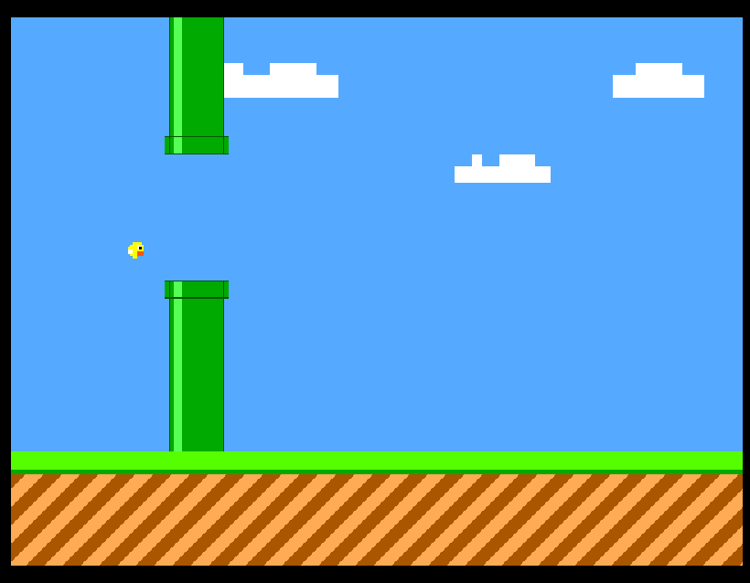

   

# IEEE Flappy Bird VGA Game 🐤

Welcome to the **Flappy Bird VGA Game** for Tiny Tapeout! 

This project is a hardware implementation of the classic Flappy Bird game written in Verilog for 640x480 @ 60 Hz VGA displays.

Instead of using frame buffers or external memory, the graphics are rendered completely on-the-fly pixel by pixel. The core includes custom bitmapped ROM sprites for the bird, dual-layer parallax scrolling for background clouds, and procedural gap generation for the pipes.

## 🕹️ Key Features

* **Hardware-Driven Physics:** Fixed-point arithmetic (`12-bit`) to manage gravity acceleration, terminal velocity limits, and jump impulses.
* **Procedural Pipe Gaps:** Gap heights are randomized dynamically on each wrap-around using a free-running LFSR counter.
* **Multi-Layer Parallax Background:** Dual-speed cloud scrolling and animated checkered floor logic to create a sense of depth.
* **Resource Efficient:** Fits entirely within a single **1x1 Tiny Tapeout tile** using pure Verilog logic without external RAM.

## 📖 Project Documentation

For a complete technical breakdown and setup instructions, please visit the documentation folder:

* Hardware FSM architecture and collision detection logic.
* Fixed-point physics equations and sprite ROM definitions.
* Testbench setup with Cocotb and deployment guides for the **TinyVGA PMOD**.

👉 **Check out the detailed documentation at [`docs/info.md`](docs/info.md)**

## Resources

- [FAQ](https://tinytapeout.com/faq/)
- [Digital design lessons](https://tinytapeout.com/digital_design/)
- [Learn how semiconductors work](https://tinytapeout.com/siliwiz/)
- [Join the community](https://tinytapeout.com/discord)
- [Build your design locally](https://www.tinytapeout.com/guides/local-hardening/)
